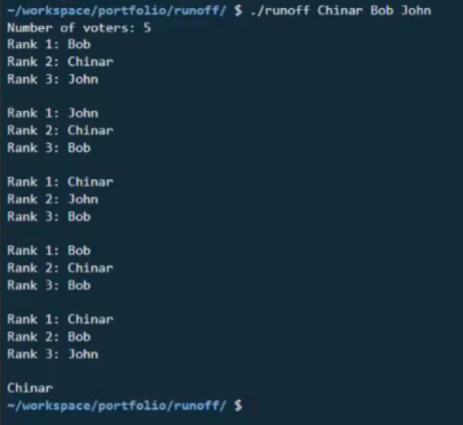

[![Contributors][contributors-shield]][contributors-url]
[![Forks][forks-shield]][forks-url]
[![Stargazers][stars-shield]][stars-url]
[![Issues][issues-shield]][issues-url]
[![MIT License][license-shield]][license-url]
[![LinkedIn][linkedin-shield]][linkedin-url]

<!-- PROJECT LOGO -->
<br />
    
<p align="center">
  <a href="https://github.com/chinarjoshi/runoff-election-simulator">
    
  </a>

  <h1 align="center">Runoff Election Simulator</h1>

  <p align="center">
    Simulate a runoff election in the command line
    <br />
    <a href="https://github.com/chinarjoshi/runoff-election-simulator"><strong>Explore the docs »</strong></a>
    <br />
    <br />
    <a href="https://youtu.be/r9-8qcNwKmk">View Demo</a>
    ·
    <a href="https://github.com/chinarjoshi/runoff-election-simulator">Report Bug</a>
    ·
    <a href="https://github.com/chinarjoshi/runoff-election-simulator">Request Feature</a>
  </p>
</p>

<!-- TABLE OF CONTENTS -->
<details open="open">
  <summary>Table of Contents</summary>
  <ol>
    <li>
      <a href="#about-the-project">About The Project</a>
    </li>
    <li>
      <a href="#getting-started">Getting Started</a>
      <ul>
        <li><a href="#installation">Installation</a></li>
      </ul>
    </li>
    <li><a href="#usage">Usage</a></li>
    <li><a href="#roadmap">Roadmap</a></li>
    <li><a href="#contributing">Contributing</a></li>
    <li><a href="#license">License</a></li>
    <li><a href="#contact">Contact</a></li>
    <li><a href="#acknowledgements">Acknowledgements</a></li>
  </ol>
</details>


<!-- ABOUT THE PROJECT -->
## About The Project

### Inspiration
I noticed that it was difficult to find an API to query meteorological data for a specific region on a specific day, so I created a minimalist web API that allows the user to query climate data from 30 years ago to today from numerous meteorological stations across the United States. The targeted audiences are researchers who would like to obtain very specific data that is difficult to find in other places.

### What it does
The tool queries the National Climate Data Center's meteorological database and returns the data specified by the user in the form of a table. The queries are conducted in log(n) time due to the use of SQL indices, thus the application is very responsive.

### How I built it
This application is built using Flask with Python, jQuery with JavaScript to asyncronously update the website, and the Bootstrap framework to rapidly develop the CSS. The NCDC's meteorological database was used and installed in the form of a csv. The back-end stack is needed to make SQL queries to the included database.

### Challenges I ran into
This project was also developed for learning purposes as I was dipping my toes into web development, so it was challenging to build a cohesive product while simutaneously learninig what languages and technologies I needed to make it happen. However, in the end I learned about the various web framworks for Python and JavaScript, development stacks, and how to develop a web application.


## Getting Started

1. Clone the repo
   ```sh
   git clone https://github.com/chinarjoshi/runoff-election-simulator
   ```
2. Execute precompiled binary
   ```sh
   ./runoff-election-simulator/runoff <candidate 1 name> <candidate 2 name> ...
   ```

<!-- USAGE EXAMPLES -->
## Usage

<p align="center">
  <a href="https://github.com/chinarjoshi/runoff-election-simulator">
    
  </a>
</p>

This tool can be used to simulate a runoff election with any number of candidates and voters.

```sh
./runoff-election-simulator/runoff <candidate 1 name> <candidate 2 name> ...
```

_For more examples, please refer to the [Documentation](https://github.com/chinarjoshi/runoff-election-simulator)_

<!-- ROADMAP -->
## Roadmap

### Features
The following features will be implemented in the future.
1. Add more variants of elections in addition to runoffs
2. Format functionality as a website
3. View past election results with a web API

__See the [open issues](https://github.com/chinarjoshi/runoff-election-simulator) for a list of proposed features (and known issues).__


<!-- CONTRIBUTING -->
## Contributing

Any contributions to extend features are **greatly appreciated**.

1. Fork the Project
2. Create your Feature Branch (`git checkout -b feature/newFeature`)
3. Commit your Changes (`git commit -m 'Add NewFeature'`)
4. Push to the Branch (`git push origin feature/newFeature`)
5. Open a Pull Request

<!-- CONTACT -->
## Contact

Chinar Joshi - chinarjoshi7@gmail.com

Project Link: [https://github.com/cjoshi7/covid19-date-selector](https://github.com/chinarjoshi/runoff-election-simulator)

Linkedin: https://linkedin.com/in/chinar-joshi-905493207/

<!-- ACKNOWLEDGEMENTS -->
## Acknowledgements
* [Thermometer Icon](https://dndi.org/diseases/covid-19/target-product-profile/)
* [Readme Template](https://github.com/othneildrew/Best-README-Template)
* [Img Shields](https://shields.io)
* [GitHub Pages](https://pages.github.com)
* [Animate.css](https://daneden.github.io/animate.css)
* [Loaders.css](https://connoratherton.com/loaders)

<!-- MARKDOWN LINKS & IMAGES -->
<!-- https://www.markdownguide.org/basic-syntax/#reference-style-links -->
[contributors-shield]: https://img.shields.io/github/contributors/chinarjoshi/runoff-election-simulator?style=for-the-badge
[contributors-url]: https://github.com/chinarjoshi/runoff-election-simulator/graphs/contributors
[forks-shield]: https://img.shields.io/github/forks/chinarjoshi/runoff-election-simulator?style=for-the-badge
[forks-url]: https://github.com/chinarjoshi/runoff-election-simulator/network/members
[stars-shield]: https://img.shields.io/github/stars/chinarjoshi/runoff-election-simulator?style=for-the-badge
[stars-url]: https://github.com/chinarjoshi/runoff-election-simulator/stargazers
[issues-shield]: https://img.shields.io/github/issues/chinarjoshi/runoff-election-simulator?style=for-the-badge
[issues-url]: https://github.com/chinarjoshi/runoff-election-simulator/issues
[license-shield]: https://img.shields.io/github/license/chinarjoshi/runoff-election-simulator?style=for-the-badge
[license-url]: https://github.com/chinarjoshi/runoff-election-simulator/blob/master/LICENSE.txt
[linkedin-shield]: https://img.shields.io/badge/-LinkedIn-black.svg?style=for-the-badge&logo=linkedin&colorB=555
[linkedin-url]: https://www.linkedin.com/in/chinar-joshi-905493207/
[product-screenshot]: images/screenshot.png
